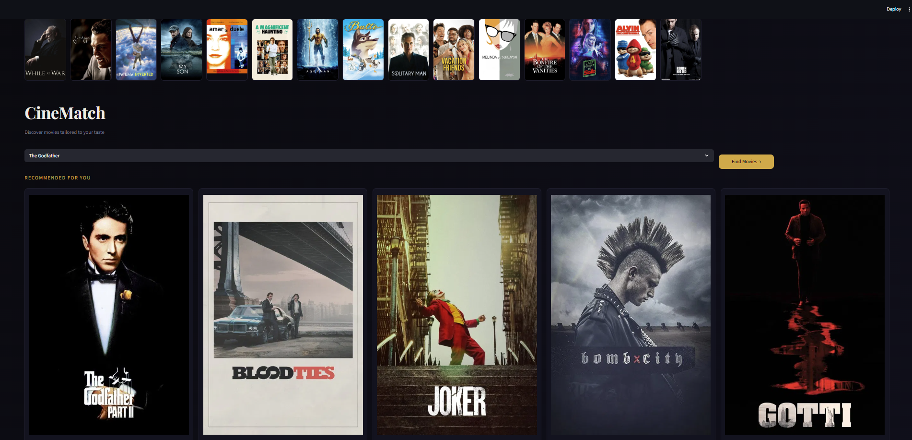

# 🎬 CineMatch — Movie Recommender System

A content-based movie recommendation system built with Python and Streamlit that suggests similar movies based on your selection, complete with live poster fetching via the TMDB API.

## Demo



## Features

- 🎥 Content-based filtering using cosine similarity
- 🖼️ Live movie poster fetching via TMDB API
- 🎞️ Scrollable banner of random movie posters
- ⚡ Fast recommendations powered by precomputed similarity scores
- 🌙 Cinematic dark UI with gold accents

## Tech Stack

- **Frontend**: Streamlit
- **Backend**: Python
- **ML**: Scikit-learn (TF-IDF + Cosine Similarity)
- **Data**: TMDB 5000 Movies Dataset
- **API**: TMDB API (poster fetching)

## Project Structure

```
MOVIERECOMMENDATIONSYSTEM/
├── app.py                  # Streamlit app
├── Main.ipynb              # Data preprocessing & model building
├── dataset.csv.csv         # Raw movie dataset
├── movies_list.pkl         # Processed movies dataframe
├── similarity.pkl          # Precomputed similarity matrix
├── .env                    # API keys (not committed)
├── .gitignore
└── requirements.txt
```

## Getting Started

### 1. Clone the repository

```bash
git clone https://github.com/your-username/movie-recommender-system.git
cd movie-recommender-system
```

### 2. Create and activate a virtual environment

```bash
python -m venv venv

# Windows
venv\Scripts\activate

# Mac/Linux
source venv/bin/activate
```

### 3. Install dependencies

```bash
pip install -r requirements.txt
```

### 4. Set up environment variables

Create a `.env` file in the root directory:

```
TMDB_API_KEY=your_tmdb_api_key_here
```

Get a free API key at [themoviedb.org](https://www.themoviedb.org/settings/api).

### 5. Generate the pickle files

Open `Main.ipynb` in Jupyter and run all cells to generate `movies_list.pkl` and `similarity.pkl`.

### 6. Run the app

```bash
streamlit run app.py
```

Open your browser at `http://localhost:8501`

## How It Works

1. Movie metadata (genres, keywords, cast, crew, overview) is combined into a single "tags" column
2. TF-IDF vectorization converts tags into numerical vectors
3. Cosine similarity is computed between all movie vectors
4. When a movie is selected, the top 5 most similar movies are returned

## Requirements

```
streamlit
pandas
numpy
scikit-learn
requests
python-dotenv
pickle5
```

## License

MIT License — feel free to use and modify.

## Author

Built by [Moses Itapara](https://github.com/MosesItapara)
